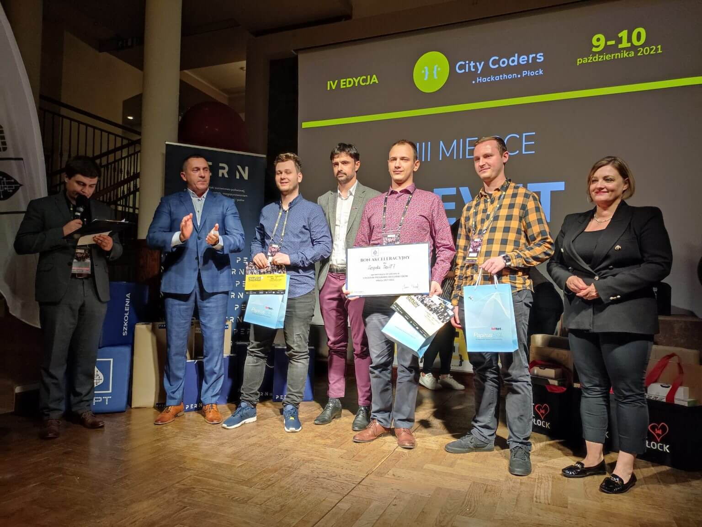

### Czwarta edycja hackathonu City Coders

Podaczas tej edycji ja i mój zespół zajęliśmy trzecie miejsce. Aplikacja, którą nagrodzono to nasze autorskie rozwiązanie służące do sprawdzania ile osób znajduje się w danej strefie. Aplikacja wspomaga proces ewakuacji a także może zostać użyta jako narzędzie analityczne.

### Start in Park

Obecność na podium zagwarantowała nam miejsce w programie akceleracyjnym Start in Park.